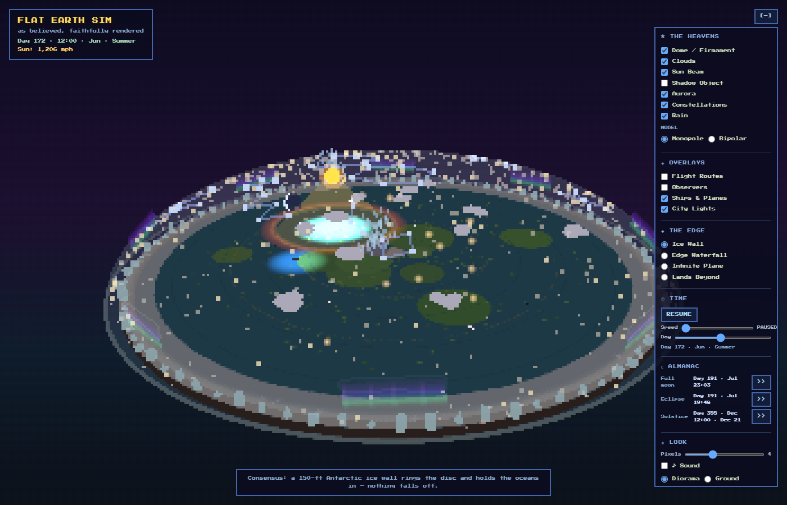
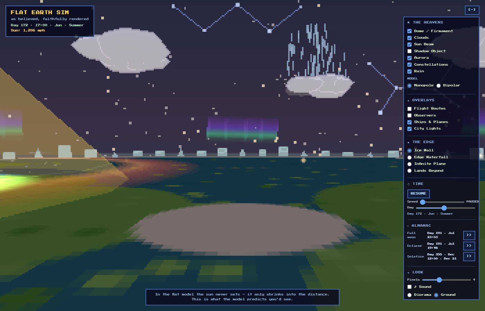
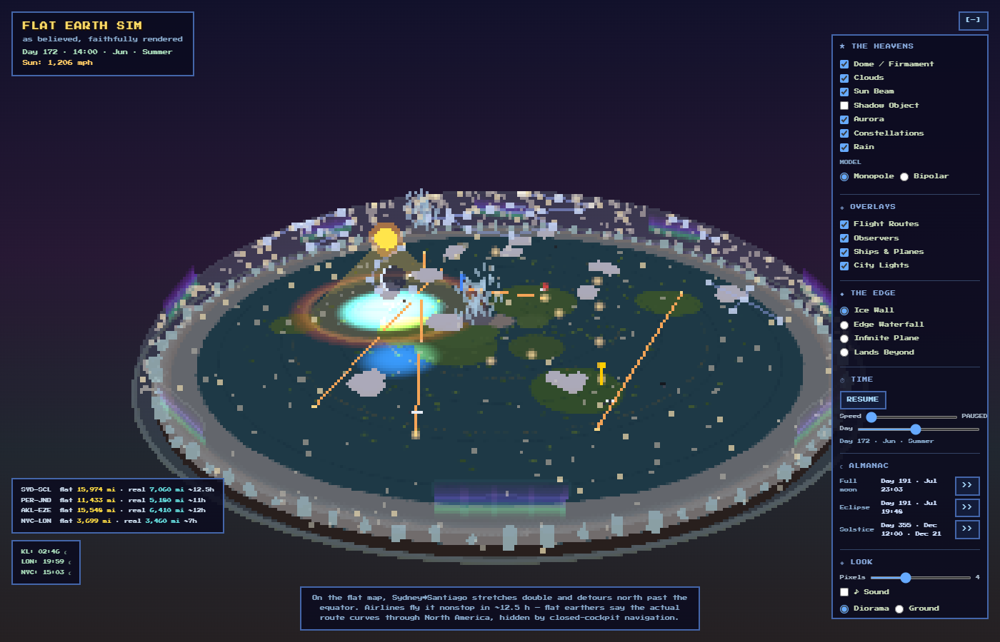
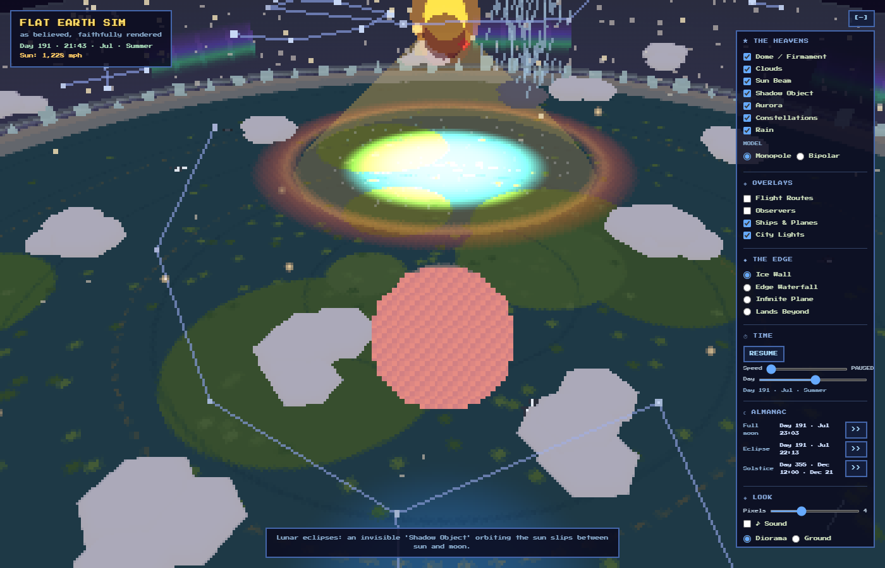
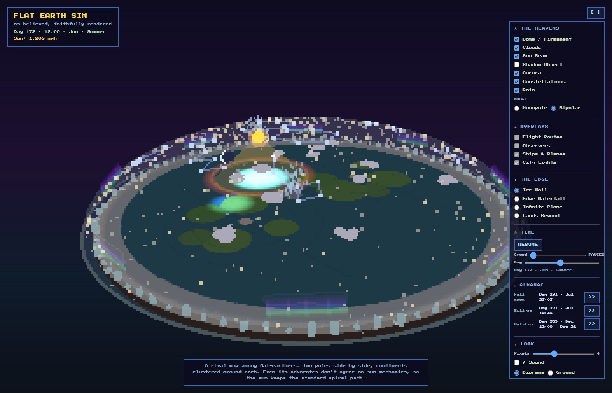
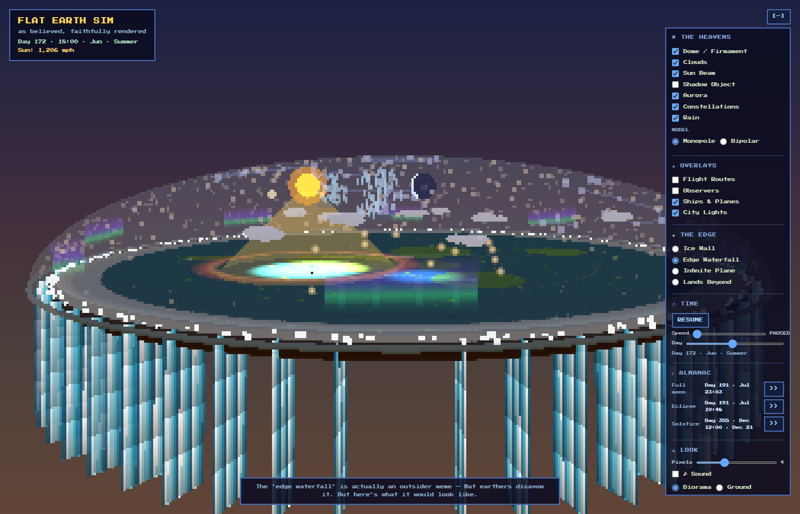
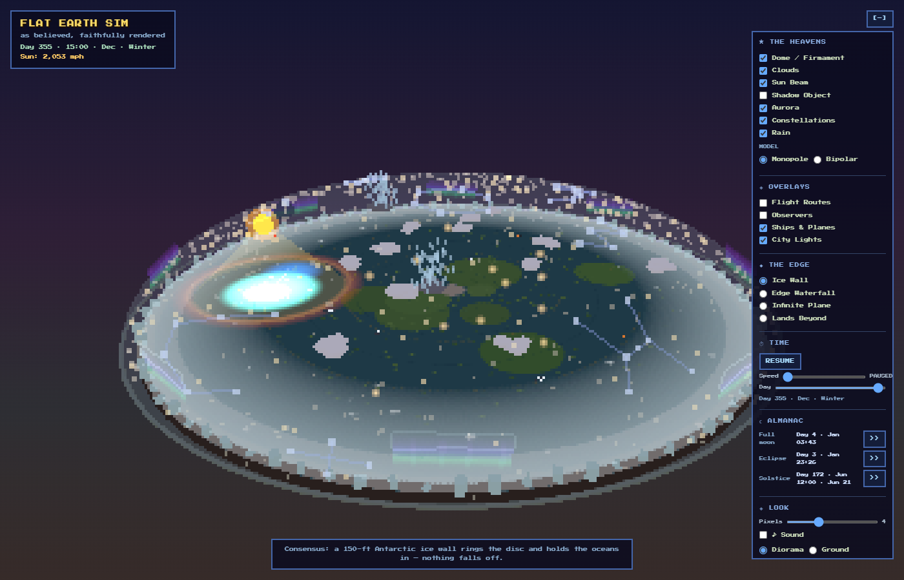

# Flat Earth Sim

*A cozy pixel-art simulation of the flat earth — exactly as its believers describe it. Not a debunk; a faithful render of the lore.*

**▶ Live demo: [shanahan-suresh.github.io/flat-earth-sim](https://shanahan-suresh.github.io/flat-earth-sim/)**



Built with **Three.js 0.180.0 + RenderPixelatedPass** for a chunky pixel-diorama aesthetic. This is an earnest simulation, not a parody.

---

## What is this?

A real-time 3D diorama of the flat-earth consensus model as described by [TFES (The Flat Earth Society)](https://wiki.tfes.org) and related communities. Every constant, mechanic, and doctrine is sourced — see [The Model](#the-model-being-simulated) and [Sources](#sources).

- The sun orbits in a spiral above the disc, spotlighting a fraction of the surface (day/night)
- The moon is self-luminous and phases relative to the sun
- Stars rotate on a sidereal wheel; Polaris is fixed at the apex
- Planets follow Tychonic epicycles around the sun
- A Shadow Object causes lunar eclipses — and an eclipse finder jumps you to the next one
- Four edge theories are selectable: Ice Wall, Edge Waterfall, Infinite Plane, Lands Beyond
- Stand on the disc in Ground view and watch the sun shrink into the distance — it never sets, exactly as the model predicts

---

## What's new in v1.3 — the Honest Update

A maintenance release: one lore bug, one UX bug, and the repo put in order.

- **Map scale fixed.** v1.1's "true AE" map squeezed 180° of latitude into 86% of the disc, so the lore sun (4,600 mi path in June) sat over 12°N instead of the Tropic of Cancer, and 42°S in December instead of Capricorn. The south pole now sits at the disc edge — Antarctica *is* the rim, which is the lore — and the continents, routes, observers and city lights all moved outward ~16% to match. Faint dashed tropic circles mark the sun's turning paths; a unit test pins Cancer/Capricorn under the solstice sun paths. Sydney–Santiago's flat distance is now 15,974 mi.
- **🔗 COPY LINK** (LOOK section) builds a URL that reproduces the exact view. URL parameters are now one-shot: applied on load, then stripped, so a postcard you clicked last week can no longer override today's settings on reload (v1.1–1.2 did exactly that).
- **Same diorama every load** — build-time randomness (ice-wall blocks, clouds, islands, star field, map speckle) is seeded, so a shared link shows the frame you saw.
- **Phone layout** — bigger type and tap targets under 640 px; the panel starts collapsed, `[+]` opens it.
- **Doctrine vs flavour** — invented v1.2 colour (constellation and shower names, ship loops, city set) is labelled as such in the README, the About modal and its tooltips.
- **Tests + CI** — `node --test` pins the almanac math, the eclipse finder, the projection scale and the URL state round-trip; GitHub Actions runs it on push. No npm, no dependencies.
- **Housekeeping** — MIT licence, the font's OFL text, a favicon (no more 404 in the smoke-test log), description/OG meta for link previews, and `js/state.js` so adding a toggle is one schema entry instead of edits in four lists.

## What's new in v1.2 — the Cozy Update

The disc got livelier and warmer without losing an ounce of lore.

- **☾ ALMANAC panel** — a new panel section that always shows the next **full moon**, the next **Shadow-Object eclipse**, and the next **solstice**, each with a ⏩ button to jump straight there. When a meteor shower is running, its name lights up (`☄ THE LANTERNFALL`). The eclipse ⏩ moved here from the TIME section; `?eclipse=1` still works.
- **Shooting stars & meteor showers** — faint streaks cross the dome on the night side. Three lore-named showers recur on the calendar and multiply the rate: *The Lanternfall* (day 224), *The Wheelwright's Sparks* (day 349), *The Dome-Menders* (day 4).
- **Constellations** — eight named figures hang on the underside of the dome and ride the sidereal wheel. *The Hub* circles Polaris, "the one nail that never moves." Toggle in ★ THE HEAVENS.
- **Ships & planes** — airliners fly the flat map's true routes (a 14-hour southern crossing, closed cockpits) and ships trace ocean loops. Toggle in ◈ OVERLAYS; auto-disabled on the bipolar map.
- **City lights** — thirteen cities kindle below the dome the moment the sun's spotlight slides off them, and go dark again under the day patch. Toggle in ◈ OVERLAYS.
- **Drifting rain cells** — dark cloud cells wander the disc trailing rain streaks, all in the lower air beneath the firmament. Bring the camera near a cell with sound on and the patter rises. Toggle in ★ THE HEAVENS.
- **Winter creep** — a ring of frost breathes in and out with the day of year, thickest near the December solstice and thinnest in high summer. Rides the calendar; no toggle.
- **Living ambience** — with sound on, crickets swell after dark, birdsong stitches the dawn and dusk twilight, and near the ice wall a foghorn calls through the mist. Rides the existing ♪ Sound toggle.

---

## What's new in v1.1

- **True azimuthal-equidistant map** — the disc texture now uses the real AE projection (`radius = (90 − lat)/180`, south pole at the ice ring), so the continents sit where the lore says they should. Honest note: v1.0's map was eyeballed; the disc looks slightly different now, and correctly so.
- **State persistence** — your session (toggles, time, camera, everything) is saved to `localStorage` and restored on reload. URL parameters always override. A *Reset all settings* link lives in the About modal.
- **Shareable URLs** — the full sim state serializes to query parameters (see [URL Parameters](#url-parameters)); since v1.3 the 🔗 COPY LINK button builds the link (postcards no longer write the address bar).
- **✦ POSTCARDS** — five preset framings, one click each: *Midnight Sun*, *Falls at Dusk*, *December Rush*, *Beyond the Wall*, *Blood Moon*.
- **Eclipse finder** — the **ECLIPSE ⏩** button (moved to the ALMANAC section in v1.2) solves for the next Shadow-Object lunar eclipse, jumps to two sim-hours before it at 0.5× speed, and switches the Shadow Object on. Watch the moon turn blood-red as the Shadow Object slides between sun and moon. Also reachable via `?eclipse=1`.
- **Ground view** — LOOK section radio (Diorama / Ground): stand on the disc surface. In the flat model the sun never sets; it only shrinks into the distance. RESET CAM respects whichever view you're in.
- **Day/night sky gradient** — a full-screen warm tint and star fading driven by where your camera faces relative to the sun.
- **Twilight ring** — a warm orange band rings the sun's day patch.
- **Aurora curtains** — eight additive light ribbons dance over the ice wall (THE HEAVENS ▸ Aurora).
- **Sun glitter** — a sparkle patch glints on the ocean beneath the sun.
- **Flight routes overlay** — four real southern/northern routes drawn straight on the AE map, with a distance box comparing flat-map distance to real airline distance (Sydney–Santiago: flat 13,728 mi vs real 7,060 mi in ~12.5 h — the model's most famous stretch; 15,974 mi since the v1.3 scale fix).
- **Sky observers** — KL / London / NYC pins on the disc with a live box showing each observer's local solar time and ☀/☾ day-night status.
- **Bipolar model** — MODEL radio toggles a rival two-pole flat map. Route/observer overlays auto-disable (they're projected for the monopole map).
- **Lore tooltips** — hover any control for two or three sentences of faithful lore, sourced like everything else.
- **📷 Photo mode** — hides all UI; press **S** to save a PNG of the frame, **Esc** to exit.
- **♪ Procedural audio** — wind and a low firmament pad, synthesized live with WebAudio (no audio files). Waterfall noise crossfades in on the Edge Waterfall mode. Default off.

---

## Screenshots

| Ground view — the sun that never sets | Flight routes & observers |
|---|---|
|  |  |

| Blood moon — the Shadow Object aligns | Bipolar model |
|---|---|
|  |  |

| Edge Waterfall | December sun (large outer orbit) |
|---|---|
|  |  |

---

## Run it

**Windows (quickest):**

```
run.bat
```

**Any platform:**

```
python -m http.server 8000
```

Then open **http://localhost:8000**

> ES modules are CORS-blocked when opened directly from `file://` — always serve via HTTP.

---

## Controls

| Input | Action |
|---|---|
| Left-drag | Orbit camera (look around, in Ground view) |
| Right-drag / two-finger | Pan (Diorama only) |
| Scroll | Zoom (Diorama only) |
| Idle 15 s | Auto-rotate resumes (Diorama only) |
| **S** | Save PNG (in Photo mode) |
| **Esc** | Exit Photo mode |

**Right panel:**

| Section | Controls |
|---|---|
| **★ THE HEAVENS** | Toggle dome, clouds, sun beam, shadow object, aurora, constellations, rain; MODEL radio (Monopole / Bipolar) |
| **◈ OVERLAYS** | Flight Routes (with flat-vs-real distance box), Observers (KL/LON/NYC pins + local solar time box), Traffic (planes + ships), City Lights |
| **◆ THE EDGE** | Ice Wall / Edge Waterfall / Infinite Plane / Lands Beyond |
| **☾ ALMANAC** | Next full moon / eclipse / solstice, each with a ⏩ jump button; meteor-shower banner when one is active |
| **⏱ TIME** | Pause/Resume, speed (0–20×), day-of-year scrubber |
| **◈ LOOK** | Pixel size (2–8 px), ♪ Sound toggle, Diorama / Ground view radio, RESET CAM, 📷 PHOTO, 🔗 COPY LINK (shareable URL of the live view) |
| **✦ POSTCARDS** | Midnight Sun · Falls at Dusk · December Rush · Beyond the Wall · Blood Moon |
| **?** | About modal with lore constants + *Reset all settings* |

Hover any control for its lore tooltip.

---

## URL Parameters

Initial state can be set via query string — useful for sharing views and automated screenshots. Parameters override the saved (localStorage) state, are applied once, and are then stripped from the address bar, so later changes are never overridden by a stale query on reload. **🔗 COPY LINK** in the LOOK section builds the URL for the view you are looking at.

| Param | Values | Meaning |
|---|---|---|
| `edge` | `icewall` \| `waterfall` \| `infinite` \| `beyond` | Edge mode |
| `dome`, `clouds`, `beam`, `shadow` | `0` \| `1` | Toggle dome / clouds / sun beam / shadow object |
| `aurora` | `0` \| `1` | Aurora curtains over the ice wall |
| `routes` | `0` \| `1` | Flight routes overlay + distance box |
| `observers` | `0` \| `1` | Observer pins + local solar time box |
| `traffic` | `0` \| `1` | Planes on the routes + ships on ocean loops |
| `lights` | `0` \| `1` | City lights that kindle on the night side |
| `constellations` | `0` \| `1` | Named dome constellations |
| `rain` | `0` \| `1` | Drifting rain cells (patter when the camera is near one) |
| `audio` | `0` \| `1` | Procedural sound (starts on first click/keypress — browser gesture rule) |
| `view` | `diorama` \| `ground` | Camera mode |
| `model` | `monopole` \| `bipolar` | Flat-earth map variant |
| `day` | 0–364 | Day of year |
| `time` | 0–24 | Time of day (decimal hours, e.g. `21.7`) |
| `speed` | 0–20 | Time multiplier (`0` = paused) |
| `px` | 2–8 | Pixel size |
| `cam` | `X,Y,Z` | Camera position (in Ground view, overrides the default standing spot) |
| `eclipse` | `1` | Action param: jump to the next Shadow-Object lunar eclipse (applied after all other state) |
| `panel` | `open` \| `closed` | Action param: force the right panel open or collapsed (phones start collapsed) |

Example: `?day=191&time=21.7&shadow=1&speed=0` — a blood moon, paused.

---

## The Model Being Simulated

| Lore constant | Value |
|---|---|
| Disc radius | 12,450 mi (10 units; 1 unit = 1,245 mi) |
| Map projection | Azimuthal equidistant on the full disc — north pole at center, south pole at the disc edge (Antarctica is the rim); 180° of latitude = 12,450 mi, so the June sun rides the Tropic of Cancer and the December sun the Tropic of Capricorn |
| Ice wall height | ~150 ft lore (exaggerated for visibility) |
| Sun diameter | 32 mi (lore); upscaled ~13× for visibility |
| Moon diameter | 32 mi (lore); self-luminous cold light |
| Sun altitude | ~3,000 mi |
| Sun path radius | 4,600 mi (Jun 21, Tropic of Cancer) → 7,840 mi (Dec 21, Capricorn) |
| Sun ground speed | 1,204 mph (Jun 21) → 2,052 mph (Dec 21) |
| Solar declination | 23.44° amplitude; path radius = 5.0 − 1.3 × sin(decl/max) |
| Moon angular rate | 347.81°/day → 29.53-day synodic month |
| Star wheel period | 23.93 h sidereal day |
| Dome apex | ~3,100–6,000 mi (flattened hemisphere, Y-scale 0.32) |
| Planets | Tychonic: epicycles around the sun's position |
| Shadow Object | Invisible satellite of the sun; causes lunar eclipses (period ~20 sim-days) |
| Synodic month | 29.53 days (full-moon spacing, solved analytically) |
| Solstices | Day 172 (Jun 21) and day 355 (Dec 21) |
| Frost ring | Breathes with `(1 + cos(2π(day − 355)/365))/2` — thickest near the Dec solstice |
| Meteor showers | The Lanternfall (day 224, ×8), The Wheelwright's Sparks (day 349, ×6), The Dome-Menders (day 4, ×5) |
| Constellations | 8 named figures fixed to the sidereal star wheel; The Hub rings Polaris |

### Celestial mechanics

The sun traces a shrinking/expanding circular path above the disc. In June (d=172) its orbit is smallest (over the "Tropic of Cancer" at r≈3.7 units); in December it is largest (r≈6.3 units). One revolution every 24 h. The spotlit circular day-patch sweeping the map is the core lore mechanic — the sun illuminates only a fraction of the disc at once, explaining day/night.

The moon follows a similar path but advances at 347.81°/day, gaining on the sun by 12.19°/day → one lap relative to the sun every 29.53 days (synodic month). Moon phase is rendered as 8 pre-drawn pixel-art frames on a billboard sprite, selected each frame from the sun–moon angular separation.

Stars are fixed to a rotating wheel (sidereal day 23.93 h). Polaris sits at the apex and does not rotate.

The eclipse finder scans forward through sim time for the next moment the Shadow Object crosses the sun–moon segment during a full moon — the same alignment math that drives the blood-red tint ramp.

### Doctrine vs flavour

Everything in the table above is sourced: the sun's path and height, the self-luminous moon, the dome, the Shadow Object, the ice wall, the bipolar rival map. The *Cozy Update* (v1.2) added colour that is **invented, not sourced** and is labelled as such in its tooltips: the constellation names and figures, the three meteor-shower names and dates, the ship loops, the city set and the 14-hour plane legs. They decorate the model; they are not claims about it.

### What the consensus actually says

- **Water does NOT fall off.** The ice wall (lore: ~150 ft of Antarctic ice) contains the oceans. The "edge waterfall" is an outsider meme; the community explicitly disavows it (included here as a toggle, labeled as such).
- **Gravity is replaced** by density & buoyancy + Universal Electromagnetic Acceleration (9.8 m/s² upward disc acceleration).
- **The moon is self-luminous**, emitting its own cold light — not reflecting the sun. This is core TFES doctrine.
- **Lunar eclipses** are caused by a dark "Shadow Object" — an invisible body orbiting the sun — not by the Earth's shadow (which would require a spherical Earth for the umbra geometry).
- **The sun never sets** — it recedes. Ground view renders this faithfully: at "sunset" the flat-model sun simply shrinks toward the horizon while remaining above it.
- **Southern flights** on the flat map stretch enormously and detour past the equator (see the routes overlay). Airlines fly Sydney–Santiago nonstop in ~12.5 h; the community's answer is that real routes are hidden by closed-cockpit navigation.
- **Southern-hemisphere 24-hour daylight** is geometrically impossible in the flat-earth model. The community denies or disputes the data.
- **Star rotation** in the southern hemisphere appears to circle a southern celestial pole — the community disputes or ignores this observation.
- **The bipolar map** — two poles side by side — is a rival model among modern communities; even its advocates don't agree on how the sun should spiral over it, so this sim keeps the standard path.

---

## Architecture

```
js/main.js        — renderer setup, EffectComposer, OrbitControls, animation loop,
                    localStorage persistence, one-shot URL params, view + edge modes
js/state.js       — STATE_SCHEMA: the one table behind apply / capture / serialize / parse
js/sim.js         — wall clock, pure sun/moon/shadow position helpers, CONSTANTS (all lore
                    values live here), eclipse/full-moon/solstice finders, meteor-shower +
                    frost math, lat/lon → disc projection
js/rng.js         — seeded build-time RNG (mulberry32) so every load renders the same scene
js/world.js       — disc geometry, ice wall, and all four edge variants; bipolar map swap;
                    frost ring, drifting rain cells
js/sky.js         — sun, moon, stars, dome, planets, Shadow Object, aurora, twilight ring,
                    sun glitter, blood-moon tint; constellations, shooting stars
js/overlays.js    — flight routes + observer pins on the AE map; distance & solar-time boxes;
                    traffic (planes + ships), city lights
js/audio.js       — procedural WebAudio: wind, firmament pad, waterfall crossfade,
                    rain, crickets, dawn/dusk birds, ice-wall foghorn
js/textures.js    — all textures procedural via Canvas 2D (no binary image assets)
js/ui.js          — right-panel HTML controls, almanac panel, postcards, lore tooltips,
                    photo mode, COPY LINK

test/             — node --test suites for sim.js and state.js (no dependencies)
vendor/           — pinned Three.js 0.180.0 (intentionally committed, no CDN)
  three.module.js — re-exports from three.core.js (both files required)
  three.core.js   — the actual build; missing = silent black canvas
  addons/         — OrbitControls, EffectComposer, RenderPixelatedPass, OutputPass
```

`index.html` contains an importmap wiring `'three'` → `vendor/three.module.js` and `'three/addons/'` → `vendor/addons/`.

---

## Dev Notes

### Unit tests

```
node --test
```

Node's built-in runner (≥ 20); no npm. `test/sim.test.js` pins the synodic month, solstice wrap, the eclipse finder against the tint function, the projection scale (Cancer under the June sun path) and the lockstep between `SimClock` getters and the pure `*At(t)` helpers; `test/state.test.js` round-trips the URL state. CI runs the same command on push.

### Smoke test

`smoke-test.html` renders one composer frame, reads back the framebuffer with `gl.readPixels`, counts lit pixels / distinct colors / scene object count, and beacons the result via `GET /SMOKE_RESULT?msg=...` (visible in the HTTP server log).

Run as:

```
python -u -m http.server 8000
```

Watch stderr/log for the `/SMOKE_RESULT` beacon **and** for 404s. The build RNG is seeded, so the beacon is stable: `lit=190336/480000 distinctColors=50 objectsInScene=34`. Do not use `--dump-dom` (races module execution) or rely on the static clock text in `index.html` (placeholder HTML).

Headless screenshots on Windows:

```
msedge --headless=new --enable-unsafe-swiftshader --use-angle=swiftshader \
  --virtual-time-budget=2500 --timeout=90000 --window-size=1400,900 \
  --screenshot=out.png "http://localhost:8000/?day=172&time=12&speed=0&panel=open"
```

Keep the virtual-time budget small: the scene renders at a few fps under SwiftShader, so 15 s of virtual time takes minutes of wall-clock. Any URL parameter works, so every README screenshot is reproducible from its query string.

### three.core.js gotcha

Three.js ≥ r167 is a **split build**: `three.module.js` re-exports from `three.core.js`. If `three.core.js` is missing, the entire module graph silently fails — black canvas, no `window.onerror`. Always commit both files together and pin one version across core and addons.

---

## Sources

- [wiki.tfes.org](https://wiki.tfes.org) — Sun, Equinox, Electromagnetic Acceleration, Universal Acceleration, Lunar Eclipse due to Shadow Object, Southern Celestial Rotation, Tides
- Wikipedia: "Modern flat Earth beliefs"
- NCSE: "The Rim at the End of the World"
- Blake Marnell: *Flat Earth Sun, Moon & Zodiac Clock* app
- Samuel Rowbotham: *Zetetic Astronomy: Earth Not a Globe* (1865) — the firmament, the receding sun, the ice barrier
- Orlando Ferguson: *Map of the Square and Stationary Earth* (1893) — early systematic monopole map

---

## Licence

MIT — see [LICENSE](LICENSE). Three.js is MIT (vendored, 0.180.0); the Press Start 2P font is under the SIL Open Font License 1.1 ([assets/PressStart2P-OFL.txt](assets/PressStart2P-OFL.txt)).
